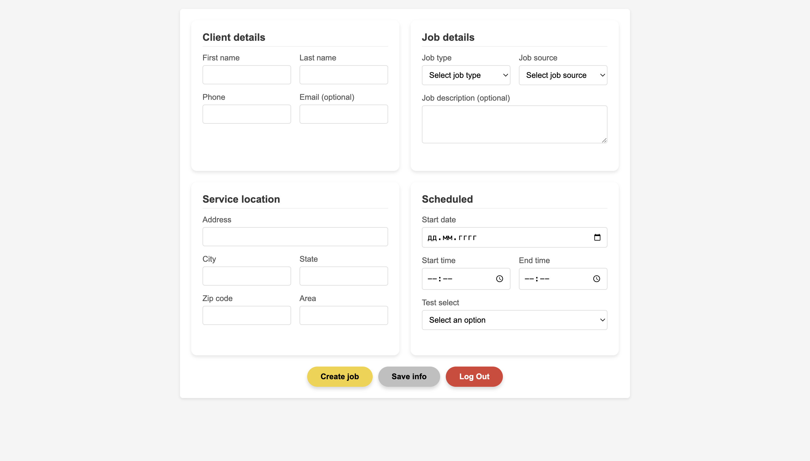

# Workiz-Pipedrive Integration

  
  
_Интеграция формы Workiz с Pipedrive CRM_

## 🚀 О проекте

Тестовое задание для позиции JavaScript Developer Intern. Веб-приложение, которое:

1. Собирает данные о клиенте и заказе через форму
2. Сохраняет информацию в Pipedrive CRM через API
3. Поддерживает авторизацию с разными аккаунтами Pipedrive

## ✨ Особенности

- 📝 Полнофункциональная форма с валидацией
- 🔐 Отдельная страница авторизации (API токен + поддомен)
- 💾 Локальное сохранение черновиков (LocalStorage)
- 🎨 Адаптивный дизайн с анимациями
- 🛡️ Защита роутинга для авторизованных пользователей

## 🛠 Технологии


## ⚙️ Установка

1. Клонируйте репозиторий:

```bash
git clone https://github.com/yourusername/workiz-pipedrive.git
```

2. Откройте auth.html в браузере или перейдите по ссылке. https://example.com

## 🔑 Авторизация

При первом запуске необходимо:

1. Ввести поддомен Pipedrive (например: yourcompany для yourcompany.pipedrive.com)

2. Указать API токен (можно получить в Pipedrive: Настройки → API)

## 🔑 Мои api, domen

1. _cfa87235e8ffce53238b8f922b3994616ea978cc_

2. _intern_

## 🌐 Деплой

Приложение успешно размещено и доступно по следующей ссылке:  
🔗 [Открыть приложение](https://example.com)

## 📜 Лицензия

MIT License. Copyright © 2023 Absat Nurlybek

<div align="center"> <sub>Спасибо за внимание! 😊</sub> </div> 
<div align="center"> <sub>Создано с ❤️ для тестового задания</sub> </div>
